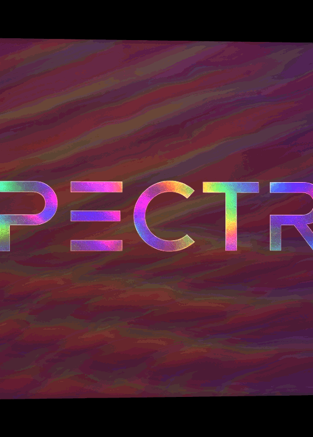
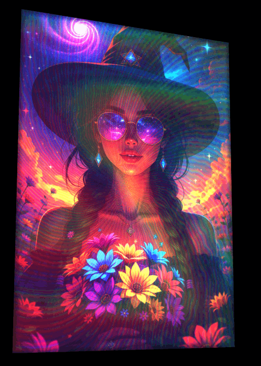
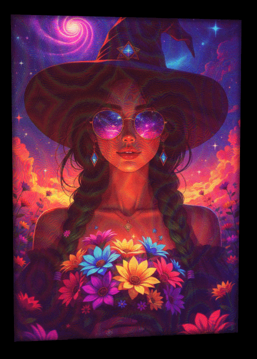
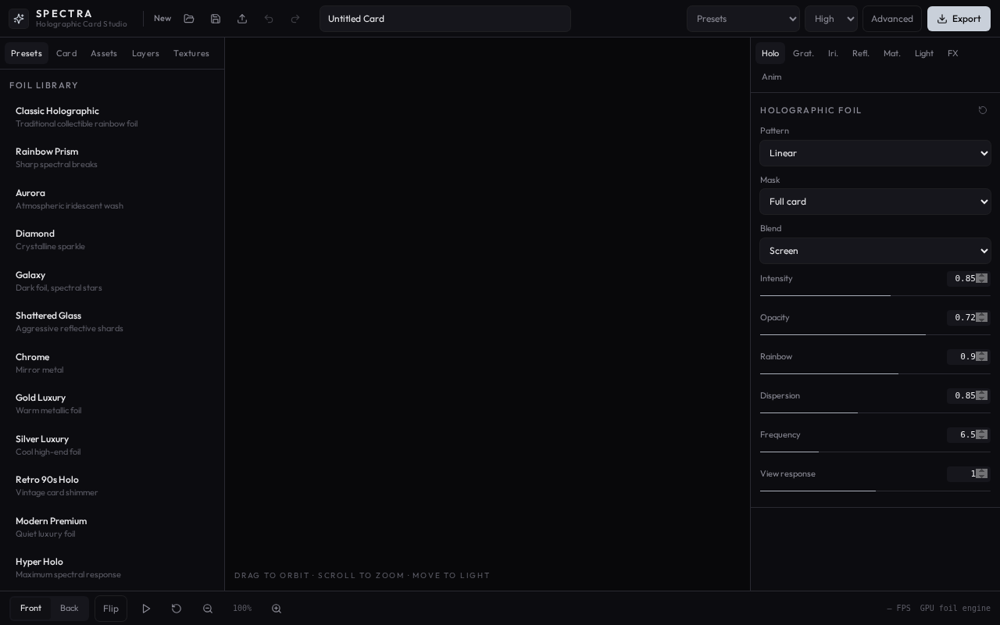
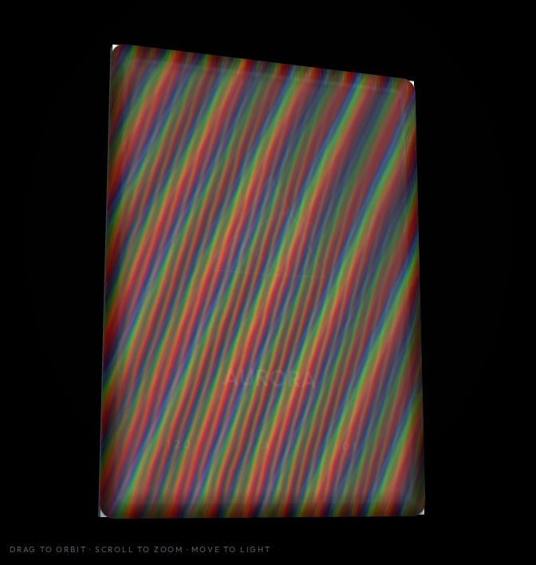
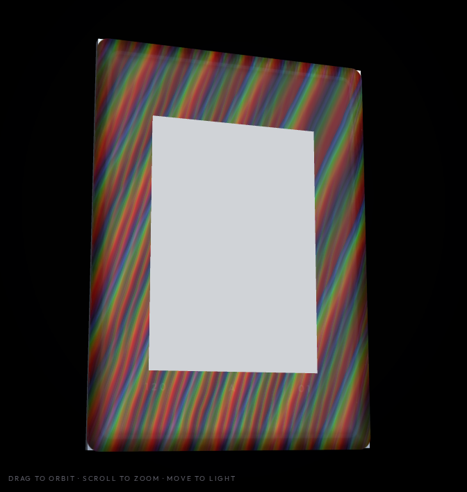

# ✦ Spectra

### Create cards that don't just look good — they **react to light**.

Spectra is an experimental, browser-based card creation studio focused on the visual language of **premium collectible cards**: holographic foil, diffraction gratings, iridescence, reflective surfaces, layered textures, and dynamic lighting.

Instead of simply placing an image inside a template, Spectra lets you build the **surface itself**.

> **Design the card. Shape the foil. Control the light. Create something that feels physical.**

<p align="center">
  <a href="https://spectra-five-jade.vercel.app/">
    <strong>✦ Open Spectra</strong>
  </a>
</p>

---

## ✨ Preview

<p align="center">
  
</p>

<h1 align="center">Spectra</h1>

<p align="center">
  <strong>Design cards that catch the light.</strong>
</p>

<p align="center">
  A browser-based card creation studio focused on holographic foil,
  diffraction grating, iridescence, reflection, and layered materials.
</p>

<p align="center">
  <a href="https://spectra-five-jade.vercel.app/">✦ Open Spectra</a>
  ·
  <a href="https://github.com/Yorzen420/Spectra">GitHub</a>
</p>

<p align="center">
  
  
  
</p>

<p align="center">
  <em>Different cards, materials, and optical effects created with Spectra.</em>
</p>

<p align="center">
  
</p>

<p align="center">
  <em>Build and preview your card in an interactive 3D-inspired workspace.</em>
</p>

---

## 🎴 What is Spectra?

Spectra is built around one idea:

**Give digital card creators control over the tiny optical details that make physical cards feel special.**

Think about the way a premium trading card behaves when you tilt it under a light:

- 🌈 Colors shift across the surface
- ✦ Foil catches highlights
- 🌀 Diffraction creates spectral rainbows
- 💎 Reflective areas produce sharp glints
- 🪞 Layers reveal different effects at different angles
- 🔮 Holographic patterns move across the artwork
- ✨ Iridescent materials change appearance depending on lighting

Spectra attempts to bring those characteristics into an interactive digital editor.

---

# 🔬 The Surface Is the Design

Most card makers treat the card as a flat image.

Spectra treats it as a **material**.

Your artwork is only one part of the final result.

```text
Artwork
   ↓
Mask / Layers
   ↓
Material
   ↓
Foil
   ↓
Diffraction
   ↓
Iridescence
   ↓
Reflection
   ↓
Lighting
   ↓
Final Card
```

This makes it possible to experiment with completely different visual identities while using the same artwork.

---

## 🌈 Optical Effects

### Holographic

Create holographic surfaces that change appearance as the viewing angle changes.

### Diffraction Grating

Simulate the characteristic rainbow spectrum produced by microscopic diffraction structures.

Perfect for:

- Rainbow foil
- Holographic backgrounds
- Spectral highlights
- Prismatic effects
- Premium collector cards

### Iridescent Foil

Create surfaces where the perceived color changes with viewing angle and illumination.

### Reflection

Control how strongly the card responds to the virtual light source.

### Layered Materials

Combine multiple visual layers to create complex surfaces instead of relying on a single texture.

---

# 🃏 Create Your Own Card

Spectra is designed around experimentation.

Upload your artwork and start building the surface around it.

### Front

Use your main artwork, character, illustration, logo, or photograph.

### Back

Create a completely separate back design.

### Surface

Build the material that sits on top of the artwork.

### Lighting

Explore how the material behaves under different illumination.

---

## 🖼️ Examples

### Example — Full Card

<p align="center">
  
  
</p>

---

### Example — Studio / Editor

<p align="center">
  
</p>

---

### Example — Canvas

<p align="center">
  
</p>

---

# ⚙️ Built for Fine Control

Spectra is not intended to hide everything behind a single **"Holographic"** button.

The goal is to expose the underlying parameters so you can discover your own look.

Depending on the material and effect, this can include controls for things such as:

- Foil intensity
- Reflection
- Iridescence
- Diffraction
- Spectral spread
- Light direction
- Surface response
- Layer opacity
- Blend behavior
- Texture contribution
- Pattern scale
- Pattern rotation
- Material depth
- Highlight strength
- Contrast
- Color behavior

The result is a system where two cards using the same artwork can look completely different.

---

# 🧪 Experimentation Over Templates

Spectra isn't trying to become another generic:

> Upload image → choose template → export

card generator.

Instead, it is intended to be a **visual experimentation tool**.

You can start with something simple:

```text
Artwork
+ subtle foil
+ soft reflection
```

Or push it much further:

```text
Artwork
+ layered mask
+ holographic foil
+ diffraction grating
+ iridescence
+ reflective highlights
+ custom lighting
+ surface textures
```

The interesting results usually happen somewhere in between.

---

# 🎨 What Can You Make?

Spectra can be used to experiment with designs inspired by:

| Style | Possible treatment |
|---|---|
| ✦ Trading Cards | Holographic / foil finishes |
| 🃏 TCG Cards | Character + layered foil |
| 🎴 Collectibles | Premium reflective surfaces |
| 🌈 Holographic Cards | Diffraction + iridescence |
| 💎 Rare Variants | High-intensity foil |
| 🪩 Art Cards | Experimental materials |
| 🖼️ Digital Collectibles | Custom optical treatments |
| 🏷️ Premium Prints | Metallic / reflective finishes |

---

# 🚀 Try It

**[Open Spectra →](https://spectra-five-jade.vercel.app/)**

No complicated workflow.

Open the studio, experiment with the controls, upload your artwork, and start building.

---

# 🛠️ Technology

Spectra is a web application built around a real-time rendering workflow.

The project currently uses technologies including:

- TypeScript
- React
- Vite
- Three.js / WebGL
- GLSL shaders
- Tailwind CSS
- Modern browser rendering APIs

The rendering layer is particularly important to Spectra because many of the visual effects are calculated dynamically rather than being baked into a static image.

---

# 🔭 Vision

The long-term goal of Spectra is to make sophisticated card finishing techniques accessible to anyone.

Physical collectible cards can have incredibly elaborate finishes:

> embossing · metallic foil · rainbow foil · diffraction · lenticular effects · textures · reflective layers · holographic patterns

Spectra explores what happens when those ideas are translated into an interactive digital environment.

Eventually, the goal is not just to make a **picture of a card**.

The goal is to make the digital card feel like a **material**.

---

# 📸 Gallery

More experiments and development captures can be found in the [`screenshots`](./screenshots) directory.

<p align="center">
  
  
</p>

<p align="center">
  
  
</p>

---

# 🧑‍💻 Development

Clone the repository:

```bash
git clone https://github.com/Yorzen420/Spectra.git
cd Spectra
```

Install dependencies:

```bash
npm install
```

Start the development server:

```bash
npm run dev
```

Then open the local development URL shown in your terminal.

---

# 🤝 Contributing

Spectra is an experimental project and is still evolving.

Ideas, experiments, improvements, shader techniques, material models, UI improvements, and bug fixes are welcome.

If you have an idea for an effect that would make a card feel more **physical, reflective, holographic, or alive**, open an issue or submit a pull request.

---

# ⭐ Support the Project

If you like the idea behind Spectra, consider giving the repository a ⭐ on GitHub.

It helps the project get discovered by other people interested in creative rendering, digital collectibles, shaders, and generative visual tools.

**[⭐ Star Spectra on GitHub →](https://github.com/Yorzen420/Spectra)**

---

<p align="center">

### ✦ Make something that catches the light.

**Spectra**

</p>
